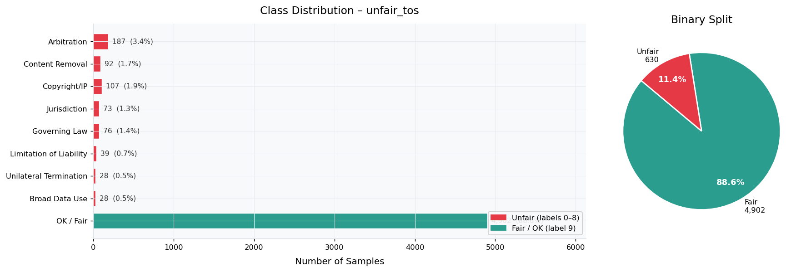
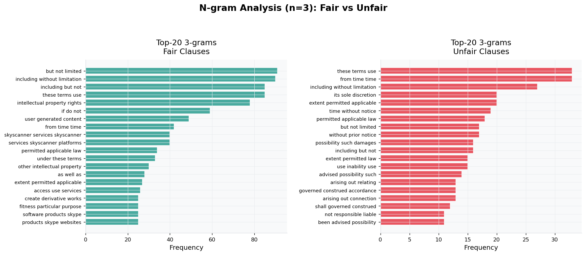
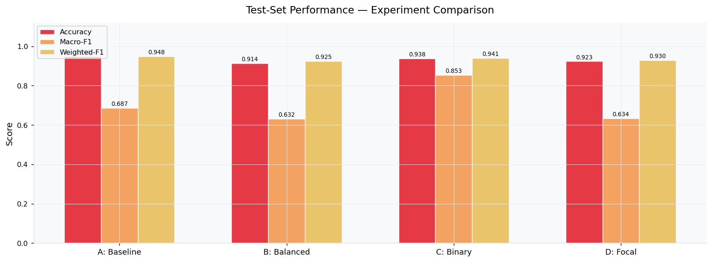
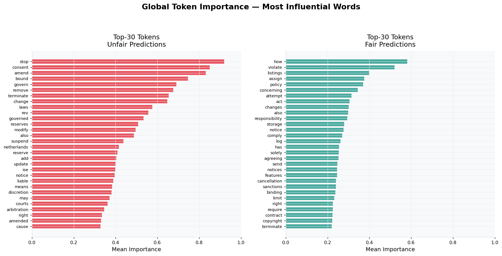
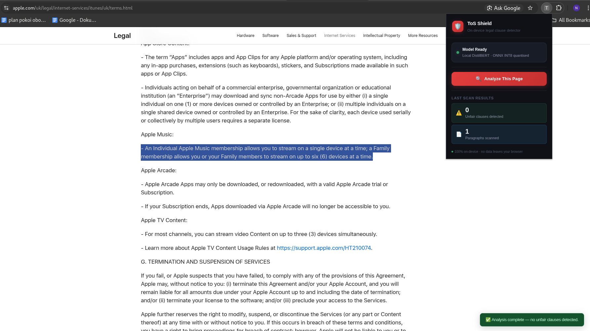
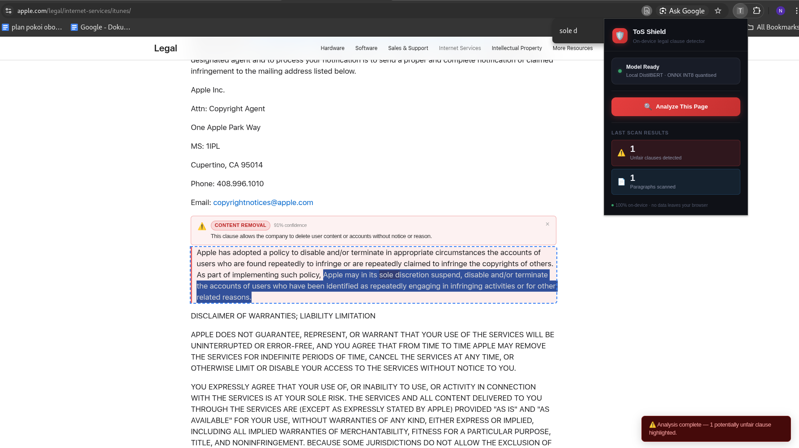

# ToShield

**Autor:** Nikodem Świerkowski, nr indeksu: 266861

**Temat:** ["własny"] — [Wtyczka do przeglądarki wykrywająca potencjalnie niesprawiedliwe fragmenty w warunki użytkowania (Terms of Usage) oraz warunki świadczenia usług (Terms of Service) serwisów internetowych, z których korzysta użytkownik.]

**Kurs:** Aspekty prawne, społeczne i etyczne w AI, PWr 2025/2026

> Lista tematów: [Zasady zaliczenia — Menu mini-projektów](https://github.com/laugustyniak/ai-ethics-law-course/blob/main/Zasady%20zaliczenia.md#menu-mini-projekt%C3%B3w)

---

## Quick Start

```bash
python3 -m venv venv
source venv/bin/activate
pip install -r requirements.txt
```

Następnie uruchom (w tej kolejności):
- 01_eda_unfair_tos.ipynb
- 02_finetune_distilbert.ipynb
- 03_onnx_export.ipynb

Aby uruchomić wtyczkę:
1. Przenieś wynikowy model z `03_onnx_export` do katalogu `ToShield/model`
2. Uruchom Google Chrome stronę `chrome://extensions/`.
3. W prawym górnym rogu, zmień tryb na wersje developerską.
4. Nowy pasek pojawi się na górze strony. Kliknij `Load unpacked`
5. Wgraj folder `ToShield/`

---

## Cel projektu

[2-3 zdania: co projekt robi i po co. Jaki problem rozwiązuje / analizuje?]

Projekt ma na celu zbudowanie wtyczki do przeglądarki, aby móc szybko zweryfikować czy zapis w umowach użytkowania są fair względem użytkownika. Większość osób nie czyta takich umów, a mały model językowy byłby w stanie znacznie ułatwić weryfikację wiarygodności firmy i jej usługi. Co więcej model działa lokalnie, więc nie ma zawachania, że ktoś wytrenuje model, by omijał część treści umów.
Projekt obejmuje analizę zbioru danych, wytrenowanie modeli, zbadanie ich działania, a także zbudowanie aplikacji.


## Powiązanie z projektem grupowym

[Jak mini-projekt wiąże się z Waszym projektem naukowo-wdrożeniowym? Jeśli nie — napisz dlaczego wybrałeś ten temat.]

Projekt nie jest związany z moim projektem NW, ponieważ jest on stricte naukowy, nie ma potencjału analizy w aspektach prawnych oraz moralnych.

Ten projekt wydał mi się zarówno ciekawy pod względem programistycznym: Jak zbudować wystarczająco mały (aby działał lokalnie), skuteczny (aby był warty używania) model językowy? 

A także pod względem moralnym: rozwiązuje faktyczny problem, który występuje, a jest powszechnie ignorowany, wpływając na zmniejszanie świadomości działania platform webowych i ich sposobu przetwarzania danych.

Dodatkowo projekt dał mi możliwość analizy zbioru Terms of Usage, a także działania modeli na nim, co zwiększyło moją wiedzę o kluczowych zapisach w takich umowach. 

## Wymagania

Projekt korzysta z [uv](https://docs.astral.sh/uv/) — szybkiego menedżera pakietów Python.

```bash
# Instalacja uv (jeśli nie masz)
curl -LsSf https://astral.sh/uv/install.sh | sh

# Instalacja zależności
uv sync

# Z notebookami Jupyter
uv sync --extra notebooks
```

**Zmienne środowiskowe** — skopiuj plik `.env.example` i uzupełnij klucze API:

```bash
cp .env.example .env
# Uzupełnij klucze w .env (OpenAI / Anthropic / Google — w zależności od projektu)
```

## Uruchomienie

```bash
# Główny skrypt (zamień na swój po implementacji)
uv run src/main.py

# lub notebook
uv run jupyter notebook notebooks/analiza.ipynb
```

## Wyniki

[Najważniejsze wyniki — tabelki, wykresy, liczby. Wstaw bezpośrednio lub linkuj do plików w `wyniki/`.]


### 1. Analiza Zbioru Danych

Zbiór **`lex_glue / unfair_tos`** zawiera 9 414 fragmentów regulaminów internetowych podzielonych na 10 klas — 9 kategorii nieuczciwych klauzul oraz klasę „OK / Fair".

Kluczowe spostrzeżenie: **88,6% zbioru to klauzule uczciwe**. Globalny współczynnik nierównowagi klas wynosi **175** (stosunek klasy większościowej do najrzadszych klas: „Unilateral Termination" i „Broad Data Use"). To odzwierciedla rzeczywistość — nieuczciwe klauzule są celowo ukryte w gąszczu standardowego prawniczego tekstu, co czyni ich automatyczną detekcję szczególnie wartościową i szczególnie trudną zarazem.



Analiza n-gramów jednoznacznie potwierdza, że nieuczciwe klauzule skupiają się wokół bardzo specyficznego słownictwa — „sole discretion", „not responsible liable", „without notice" - podczas gdy uczciwe zawierają zwroty chroniące użytkownika, jak „including without limitation", intellectual property rights" czy „permitted aplicable law".



---

### 2. Wyniki Modeli i Wyjaśnialność

Przetestowano cztery warianty fine-tuningu `distilbert-base-uncased`:

| Model | Zadanie | Obsługa nierównowagi | Test Macro-F1 | Test Accuracy |
|---|---|---|---|---|
| A: Baseline | 10-klas | ❌ | **0.687** | **0.949** |
| B: Balanced | 10-klas | ✅ DS 2:1 + wagi CE | 0.632 | 0.914 |
| C: Binary | binarny | ✅ DS 2:1 + wagi CE | **0.853** | 0.938 |
| D: Focal | 10-klas | ✅ DS 2:1 + Focal γ=2 | 0.634 | 0.924 |

**Model A** osiąga najwyższe macro-F1 wśród wariantów wieloklasowych i pozwala wyświetlić użytkownikowi konkretną kategorię problemu. Paradoksalnie, brak sztucznej korekty nierównowagi okazał się korzystny: model nauczył się naturalnych proporcji klas, co odpowiada rozkładowi w prawdziwych regulaminach.

**Model C** (binarny) osiąga znacząco wyższe macro-F1 (0.853) kosztem utraty granularności — sygnalizuje jedynie „uczciwe / nieuczciwe" bez wskazania kategorii.

**Model D** (Focal loss) osiąga podobne macro-F1 jak model B (0.634), ale osiąga wyższe recall niż model A. Stąd można wnioskować, że Focal Loss pomaga modelowi lepiej wykrywać rzadkie klasy, ale nie przekłada się to na ogólną poprawę macro-F1. Mimo to ten model może być użyteczny w praktyce, ponieważ celem jest maksymalizacja wykrywania nieuczciwych klauzul, nawet kosztem większej liczby fałszywych alarmów. Stąd ten model został wybrany do dalszej analizy i implementacji w aplikacji.



#### Wyjaśnialność (XAI)

Trzy niezależne metody (Attention Rollout, Integrated Gradients, SHAP) zgodnie wskazują, że model skupia się na **semantycznie relewantnym słownictwie prawniczym**: „arbitration", „waive", „sole", „liability", „jurisdiction". Wysoka korelacja między metodami wyklucza, że model opiera decyzje na szumie lub artefaktach danych.



---

### 3. Wpływ ONNX i Kwantyzacji

Model A został wyeksportowany do ONNX i poddany **dynamicznej kwantyzacji INT8** (HuggingFace Optimum):

| Format | Rozmiar | Redukcja |
|---|---|---|
| PyTorch FP32 | 268 MB | — |
| ONNX FP32 | 268 MB | ~0% |
| **ONNX INT8** | **67,6 MB** | **−75%** |

ONNX FP32 zachowuje pełną zgodność z PyTorch (max |Δ| = 5.25×10⁻⁶, 100% zgodnych predykcji). Model INT8 wprowadza kompromis — rozmiar 4× mniejszy, ale ze spadkiem zgodności predykcji do ~55% na zbiorze testowym, z tendencją do klasyfikowania klauzul nieuczciwych jako „Fair".

Redukcja do ~68 MB jest **warunkiem koniecznym** działania w przeglądarce: CSP Manifest V3 blokuje zdalne pobieranie modelu, Chrome Web Store ma limity rozmiaru pakietu, a ONNX Runtime Web działa w ograniczonej pamięci WebAssembly. Kwantyzacja INT8 zapewnia dodatkowo ~2–4× przyspieszenie inferencji na CPU dzięki instrukcjom SIMD.

---

### 4. Działanie Aplikacji



*Okno popup z informacją o statusie modelu (zielona kropka = gotowy) oraz wynikami ostatniego skanowania — liczba wykrytych nieuczciwych klauzul i łączna liczba przeskanowanych akapitów.*



*Podświetlony na czerwono akapit zawierający potencjalnie nieuczciwą klauzulę. Powyżej injected jest karta ostrzegawcza z kategorią (np. „ARBITRATION"), poziomem pewności modelu ONNX oraz jednozdaniowym wyjaśnieniem — bez żadnego zewnętrznego API.*


## Wnioski merytoryczne

[Kluczowa sekcja — co wynika z analizy w kontekście prawa / etyki / regulacji AI? Konkretne obserwacje i rekomendacje.]

Po pierwsze, model jest w stanie skutecznie wykrywać nieuczciwe klauzule w regulaminach, co może znacząco zwiększyć świadomość użytkowników i ich ochronę prawną. 

Po drugie, analiza XAI potwierdza, że model opiera swoje decyzje na semantycznie relewantnych cechach językowych, a nie na artefaktach danych — co jest kluczowe dla zaufania do systemu. Przede wszystkim co jest istotne, to że po zobaczeniu przykładów, można dostrzec powtarzalne wzorce językowe, które są charakterystyczne dla klauzul nieuczciwych — co może być cenną wskazówką dla zwykłych użytkowników, by łatwiej rozpoznawać nieuczciwe klauzule.

Po trzecie, zastosowanie kwantyzacji i formatu ONNX umożliwia działanie modelu bezpośrednio w przeglądarce, potencjalnie pozwala to na bardziej prywatne i dostępne rozwiązanie. Wyobraźmy sobie o kolejnych następstwach - wtyczki wykrywające wiadomości phishingowe, fałszywe recenzje, czy nawet dezinformację w mediach społecznościowych — wszystko to działające lokalnie, bez konieczności wysyłania danych do zewnętrznych serwerów.

## Ograniczenia

[Czego projekt nie robi? Co można by rozszerzyć? Bądź uczciwy.]

Projekt na pewno cierpi na brak drugiego modelu wyjaśniającego, dlaczego dany fragment został uznany za niesprawiedliwy. Dodatkowo, model jest trenowany na małej ilości danych, więc jego skuteczność może być ograniczona. W przyszłości można by rozszerzyć zbiór danych. 
Dalej dystansowo można by rozważyć bardziej zaawansowane modele, które lepiej radzą sobie z długimi tekstami oraz bardziej zaawansowanej kwantyzacji, która umożliwiłaby wykorzystanie bardziej zasobożernych rozwiązań po stronie klienta.

## Źródła

- [Nazwa źródła](URL) — krótki opis
